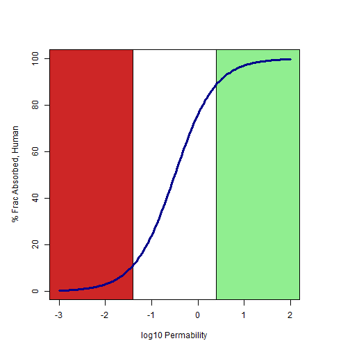

## Description of Problem

- Oral bioavailability is an important consideration in drug development

- High oral bioavailability necessary for dosing as tablets

- Tablet dosing leads to much stronger patient compliance and less-expensive treatment.

- It is very economically advantageous to fail compounds with poor oral bioavailability early in development

--- &twocol w1:40% w2:60%

## Available Measures
*** =left
- Ideal measure would be fractional drug absorbance in humans.  But ... <i>in vivo</i> assays are difficult and expensive
- <i>in vitro</i> assays are much more cost-effective and parallelizable
- Assays have been shown to correlate well with fractional drug absorbance.

*** =right
 

--- .class #id

## Even Cheaper Than Experiment

- We can model the in vitro permeability using a few physical parameters of our molecules

log P(apparent) = -1.64 + 0.85 * log K(O/W) - 0.025 * TPSA - 0.27 * (pKa - pH)

K(O/w) = octanol-water partition coefficient

TPSA = Total polar surface area of molecule

pKa = -base-10 logarithm of acidity constant for molecule

pH = -base-10 logarithm of H+ activity in assay solution

(pKa - pH) = likelihood molecule is charged

--- &twocol w1:40% w2:60%

## Utility of Application

*** =left
 

*** =right
- Properties are easily calculated from a webform
- Analyst can visualize the permeability of their compound, even before synthesis.
- Allows analysts to concentrate on making compounds that will not fail early

- Next generation of app will allow user to draw molecule to create a fully-automated workflow.

